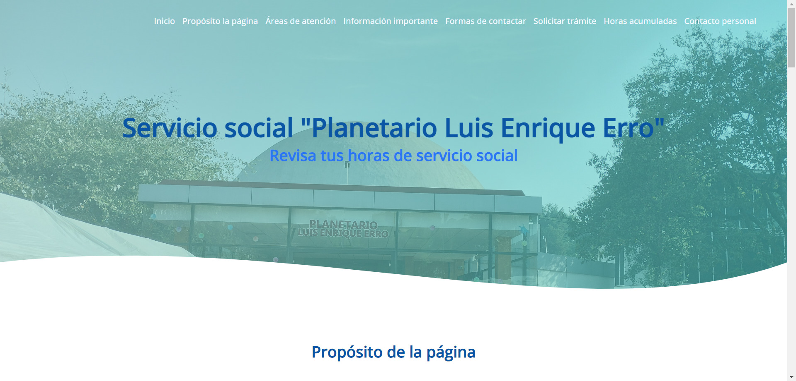
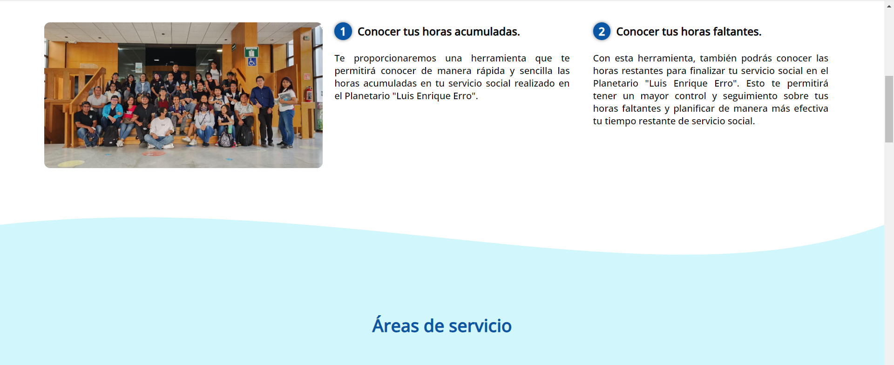

# Planetario Luis Enrique Erro

Este repositorio alberga el diseño inicial y la primera versión del desarrollo de un sitio web destinado al Planetario Luis Enrique Erro del Instituto Politécnico Nacional (IPN). El propósito de este sitio web es proporcionar información acerca del servicio social y, además, visualizar las horas de servicio de cada miembro del equipo de servicio social (es importante destacar que en esta primera versión, las horas aún no se encuentran disponibles).

# Capturas de pantalla

# Como ejecutar la aplicacion

1. Descargar el repositorio
2. Descargar los recursos visuales
   1. En la seccion de recursos visuales, entrar al link
   2. Descargar la carpeta que se encuentra en el drive
   3. Descomprimir la carpeta de img
   4. Agregar todas las imagenes en la carpeta img del proyecto

# Recursos visuales

[Carpeta img](https://drive.google.com/drive/folders/1jtNZsj2n6iZS77zgRdDmuEtdf6lRkrHT?usp=sharing)

# Autor

[Josmar Gustavo Palomino Castelan](https://linktr.ee/josmar360)
